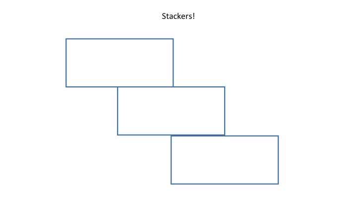

# Introduction to HTML5 and CSS3

##### HTML and CSS
- HTML and CSS work together to create the front end structure and design.
- Front end frameworks and the grid system.

##### Tags:
- Tags allow you to set up your document's structure.
- Attributes allow you to add additional information to a tag.
- Attributes also allow you to bridge the gap between HTML and CSS.

##### Div:
- Divs are like empty rectangles.
- They help organize content on the page.

```html
<div class="margin-top-20 logo">
	My Text Inside
</div>
```

##### Input:
- Inputs allow users to enter data to be saved to a database.
- They come in different forms to facilitate the specific data entry type.

```html
<input type="text" class="form-control" />
```

##### Select list:
- Select lists allow users to select options from a dropdown menu.

```html
<select>
	<option value="USA">United States</option>
</select>
```

##### Button:
- Buttons are HTML elements that give users the ability to submit the data entered as well as transition to new pages.

```html
<button>My Button</button>
```

##### Linking CSS with HTML
- CSS creates the look and feel of the website.
- In order to run external CSS you need to link it to the HTML. This usually goes in the `head` tag:

```html
<link rel="stylesheet" href="css/mystyle.css" />
```

##### Linking JS with HTML
- JavaScript enables interaction with the page.
- In order to run external JS you need to link it to the HTML. This usually goes before the closing `body` tag:

```html
<script src="js/script.js"></script>
```

## HTML Markup Lab
- Open the `html_form` folder and open `index.html`.
- For each comment denoted by `<!-- -->` replace the comment text with the correct HTML as per the instruction to create the form.
- Alter the CSS file to use a Google Fonts font. You will need to use the `font-family` CSS property.
- Bonus: Use CSS to change the background color of the page. Experiment with using images as backgrounds as well.
- Double Bonus: Review the CSS `transition` property documentation and try to create a small animation anywhere on the form. An example may be to highlight a border around a form field when it is clicked.

## New Tags in HTML5
- HTML5 introduced a number of "semantic" tags that give meaning to your markup.
- These new tags play a role in SEO to allow for contextual analysis of content blocks.
- Let's take a look at a list of new semantic tags [here](http://www.w3schools.com/html/html5_new_elements.asp).

## CSS and CSS3 Selectors
- Selectors play a key role in selecting DOM elements for styling.
- There are common selectors that have been around awhile, and also new selectors that give us even more control as of CSS3.
- Let's take a look at some of the most common CSS3 selectors [here](http://www.w3schools.com/cssref/css_selectors.asp).

## Shakespeare's Plays Exercise
- For this exercise we will be using the files [here](shakespeares_plays/).
- Select the `<ul>` with the ID "selected-plays" and place a gray background on it.
- Select the second and third `<h2>` elements (hint: they have classes) and make the font size larger and give them some space below.
- Change the background color of the third column of a table to gray.
- Select the `<li>` elements at the second level of the nested list and change the font color to red.
- Make every other table row in both tables have a gray background.
- Select an anchor tag that has a link to a pdf file. Change the color to blue and increase the font size.
- Select an anchor tag that has an href attribute containing the substring "asyoulikeit" and change the font color to orange.

## Selector Exercise
- Let's use Codepen.io to practice CSS selectors.
- Create at least one div with an id, and four divs with a class.
- Use CSS to apply styling to the divs based on the id and class selectors.
- Bonus: Try implementing one or more styles using a CSS3 selector (first-child, nth-child, first-of-type, etc).

## Floats
- Floating elements allows us to create a nearly unlimited number of layouts using all types of block elements.
- Floating an element essentially removes it from the standard "flow" and places it to the left or right side of its container.
- Elements can have fixed width, which will wrap underneath each other if the container is smaller than the combined widths.
- You can also used percentage width, which will have the columns respond to the screen size.
- You can tell already that the calculations can get out of hand really fast...

## Element Alignment
- To determine how we can align an element we have to first know what kind of element it is.
- Inline elements can be aligned as text, so with the `text-align` CSS property.
- Block elements can be aligned using the space around them - margin. A margin set to auto for both left and right will center the element in a container.

## The Grid Layout
- Most modern layouts operate on a standard 12-column grid system.
- If you break down any of the websites you know and love you will notice many variations on the 12 column grid.
- Each column in the grid can contain nested grids itself.
- If you want a larger box, you need to have a greater column offset.
- Here is a good pictorial to help you break it down:


## Code-Along: Let's Create Our Own Grid
- We will create a 2, 4, and 6 column grid.
- We will try nesting a grid inside another grid.

## CSS Positioning
- There are four main types of positioning that you will see most often - static, relative, absolute, and fixed.
- Static positioning is what all elements have by default. Yay!
- Relative and absolute work together - elements can be positioned absolutely relative to their container.
- Fixed position elements are essentially absolute relative to the window no matter where they are in the DOM. A.K.A. the window is always the relative parent.

## Positioning Exercise
- Try to replicate the following mockups using what we've talked about in this class so far.
- Utilize margins, padding, floats, positioning, etc.

1. Stackers!



2. The Mirror


3. The Skinny


4. The Absolute


## Introduction to DOM Manipulation
- One of the most powerful features of JS is its ability to alter the DOM.
- You can respond to events on elements, set HTML dynamically, and perform animations.

## Selecting Elements
- Like CSS, if you want to perform some action on an element you first have to select it.
- We did this in CSS through selectors such as IDs, classes, and pseudo-selectors.
- JavaScript gives us an easy way to select elements based on the same paradigm.

#### getElementById()

```
document.getElementById("my-div");
```

#### getElementsByClassName()

```
document.getElementsByClassName("my-div");
```

#### getElementsByTagName()

```
document.getElementsByTagName("my-div");
```

#### querySelector()

```
document.querySelector("#my-div");
```

#### querySelectorAll()

```
document.querySelectorAll("#my-div.my-class");
```

## setAttribute()
- JavaScript gives you the ability to dynamically alter HTML element attributes on the fly.
- This may be used to change stylistic properties such as the background color:

```javascript
document.getElementById("my-id").setAttribute("style", "background-color: red;");
```

## classList
- If you want to alter many style properties at one time, consider wrapping your properties up as a CSS class.
- JavaScript gives us access to an element's classes so we can manipulate them:

Add:

```javascript
document.getElementById("my-div").classList.add("animation");
```

Remove:

```javascript
document.getElementById("my-div").classList.remove("animation");
```

Toggle:

```javascript
document.getElementById("my-div").classList.toggle("animation");
```

## innerHTML
- When you need to replace the HTML inside of an element you can use the `innerHTML` property.

```
document.getElementById("my-div").innerHTML = "<span>New HTML here</span>";
```

## Handling Events
- There are many events you may want to respond to with JS including clicks, mouseovers, focuses, etc.
- Events can be listened for and responded to using `addEventListener`.

```
document.getElementById("my-div").addEventListener("click", function() {
	alert("Click worked!");
});
```

- If you need to handle an event that occurs on many elements you will need to attach event listeners to each element individually.
- This can be done by binding the event to a class. Let's take this example:

#### index.html

```
<div class="my-div"></div>
<div class="my-div"></div>
<div class="my-div"></div>
```

#### app.js

```
var myElements = document.getElementsByClassName("my-div");

for (var i = 0; i < myElements.length; i++) {
	myElements[i].addEventListener("click", function() {
		alert("Click worked!");
	});
}
```

## Score Keeper Lab / Homework
- We will be creating a simple score keeper application using JavaScript.
- The HTML and CSS has already been done for you [here](score_keeper_html/).
- Here are the steps you should take:
	- Step 1: Add a link to your own custom JS file before the closing body tag.
	- Step 2: Bind click events to the +5 and -5 point buttons and change the innerHTML of the score display appropriately.
	- Step 3: Bind a click event to the set score button and set the innerHTML of the score display to the score entered in the text box. You will need to use the `parseInt` function in JS to make this work.
	- **Bonus:** Create a check in your code to make sure the score will not go negative.
	- **Super Bonus:** Create a function to make the changes to the score display rather than having to write your logic over and over.