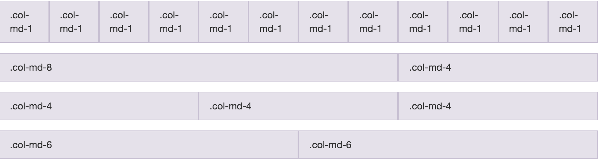

# Responsive Design

## Twitter Bootstrap
- Bootstrap is a front-end framework that incorporates a grid system, UI components, JavaScript widgets and more.
- Let's take a look at the documentation: [http://getbootstrap.com](http://getbootstrap.com/).
- The framework consists of one main CSS file, an optional theme CSS file, and a main JS file.
- Bootstrap requires jQuery to work, which is a JavaScript framework.

## Using Bootstrap
- To use Bootstrap you have to include the three required files.
- Bootstrap files can be linked via the CDN provided, or downloaded locally onto the computer.
- Remember to place your reference to the jQuery library above your reference to the Boostrap JS code.

## Bootstrap Columns
- Columns are written in this format as a class attribute: col-(breakpoint)-(offset).
- An example of a three-column layout may be to use the class col-sm-4.
- All columns should be wrapped into an element with a class of row.
- So the complete three-column layout may look something like this:

```
<div class="row">
	<div class="col-sm-4">
		Content Here
	</div>
	<div class="col-sm-4">
		Content Here
	</div>
	<div class="col-sm-4">
		Content Here
	</div>
</div>
```

## Breakpoints
- The way that Bootstrap works is to dynamically reduce column size according to the window size.
- To be mobile-friendly, the columns will break into a stack layout after a minimum width is detected.
- The breakpoints you can select in your columns control at which point this happens.
- Check out their documentation [here](http://getbootstrap.com/css/#grid) to see what these breakpoints are in terms of size.

## CSS3 Media Queries
- Media queries allow you to apply and remove CSS styling based on the screen dimensions.
- This is important to create truly mobile-friendly layouts.
- To use it you have to specify screen resolution thresholds.
- Let's try an example where we want to show a div where the screen size is larger than 700 pixels:

HTML

```
<div id="my-div"></div>
```

CSS

```
@media(min-width: 700px) {
	#my-div {
		width:400px;
		height:400px;
		border:#000 1px solid;
	}
}
```

- Now where the screen size is below 700 pixels:

CSS

```
@media(max-width: 700px) {
	#my-div {
		width:400px;
		height:400px;
		border:#000 1px solid;
	}
}
```

- You can also combine these values to select a range:

```
@media(min-width: 700px) and (max-width: 900px) {
	#my-div {
		width:400px;
		height:400px;
		border:#000 1px solid;
	}
}
```

- Good news! Bootstrap does this for you!

## Code-Along
- Let's see the grid system in action.
- We will be coding the Bootstrap grid example:



- Let's also make sure to practice using different breakpoints.

## UI Elements
- Bootstrap wraps in a myriad of great UI elements that you can drop in anywhere on your site.
- With Bootstrap you can make really pretty things quickly.
- Let's look at some [examples](http://getbootstrap.com/components/).

## Putting it Together
- Let's take a look at some of the bootstrap examples located [here](http://getbootstrap.com/getting-started/#examples).
- We will code together the "Jumbotron Narrow" template located [here](http://getbootstrap.com/examples/jumbotron-narrow/).
- Before we start, let's also plan out our grid system.

## CSS Transitions
- Transitions allow you to go between element states smoothly.
- You will often use these for animations with CSS.
- This is the syntax:

```
transition: property duration easing;
```

Let's take a look at an example:

```
.box {
	width:100px;
	height:100px;
	background-color:blue;
	transition: width 1s ease-in-out;
}

.box:hover {
	width:200px;
	height:200px;
	background-color:red;
	transition: width 1s ease-in-out;
}
```

- You can specify `all` instead of each property to animate the entire state.

## In-Class Lab
- For this lab we will be coding from scratch [this Bootstrap template](http://getbootstrap.com/examples/offcanvas/).
- Try not to look at the code through the code inspector to determine how the grid works.
- First plan out the grid you will use, then figure out which components you will need.

## What is jQuery?

jQuery is a cross-browser JavaScript library designed to simplify the client-side scripting of HTML.

It helps us out with:
- DOM traversal
- CSS manipulation through `style` attributes
- Event handling
- Animation
- And much more

## How to Use jQuery
- jQuery is available via CDN at `code.jquery.com`
- You can also download the library and serve it locally
- jQuery by itself is a library of functions. The team has also built additional tools that help us with a variety of things:
	- jQuery UI: A UI tool that adds features such as additional easings, a datepicker, modals, effects, and more.
	- jQuery Mobile: A mobile-optimized framework that allows you to create HTML5 mobile applications that look and act pretty real.

## jQuery Selectors
- The Sizzle selector engine wrapped into jQuery is a powerful tool to help us with manipulating DOM elements.
- The syntax is very similar to CSS:

```
$("#myDiv > ul > li:first-child")
```

- Here the $ sign represents the jQuery library.
- Let's take a look at some of the selectors available to us [here](http://www.w3schools.com/jquery/jquery_ref_selectors.asp).

## jQuery Actions
- Actions almost always follow selectors.
- Actions are jQuery functions that perform an operation on the element(s) selected.
- The format is as follows:

```
$("my-selector").action(options);
```

## DOM Manipulation
- The DOM manipulation functions in jQuery help you accomplish some pretty neat things.
- Here are a few common manipulations you will likely see:

On the fly CSS manipulations:

```
$("my-selector").css("property", "value");
```

On the fly HTML manipulations:

```
$("my-selector").html("New HTML inside here");
```

Altering CSS class attributes:

```
$("my-selector").addClass("new class");

$("my-selector").removeClass("class");

$("my-selector").toggleClass("class");
```

## DOM Manipulation Exercise: Shakespeare's Plays
- Download the starter code files [here](shakespeares_plays/).
- Add a class of `special` to all of the `<li>` elements at the second level of the nested list.
- Add a class of `year` to all of the table cells in the third column of a table.
	- Hint: Take a look at how many columns are in each table.
- Add the class of `special` to the first table row that has the word **Tragedy** in it.
- **Challenge:** Select all of the list items (`<li>`) containing a link (`<a>`). Add the class `afterlink` to the sibling list items that follow the ones selected.
- **Challenge:** Add the class `tragedy` to the closest **ancestor** (`<ul>`) of any .pdf link.

## Event Handling
- Event handling is done very smoothly with jQuery.
- There are a few different ways it can be performed, each having their use cases.
- Let's say we have a button and want to attach an event:

HTML

```
<button id="my-button">Click Me!</button>
```

jQuery

- This is what I like to call the shortcut method.
- It has the limitation of not working when the DOM element doesn't already exist (think AJAX loading in dynamic content).

```
$("#my-button").click(function() { //Your code here });
```

- You can also bind events using `.on`
- This is also limited to elements that already exist, but it is a better approach.

```
$("#my-button").on("click", function() { //Your code here });
```

- Lastly, you can account for dynamic elements through binding the event to the document itself.
- This also happens to be the most performant if you look at benchmark tests.

```
$(document).on("click", "#my-button", function() { //Your code here });
```

- Here is a list of the most common events you are likely to see:
	- Click
	- Keyup
	- Keydown
	- Mouseenter
	- Mouseleave
	- Dblclick
	- Change

## In-Class Lab
- For homework you will be coding the game of TicTacToe from scratch.
- You will need to write the HTML, CSS and JavaScript yourself.
- Don't do any win checking. Simply make the game so that you can click on a space and it will alternate between X's and O's.
- Make sure to check that the space a user clicks on is not already taken.
- **Bonus:** Make it pretty using Bootstrap!